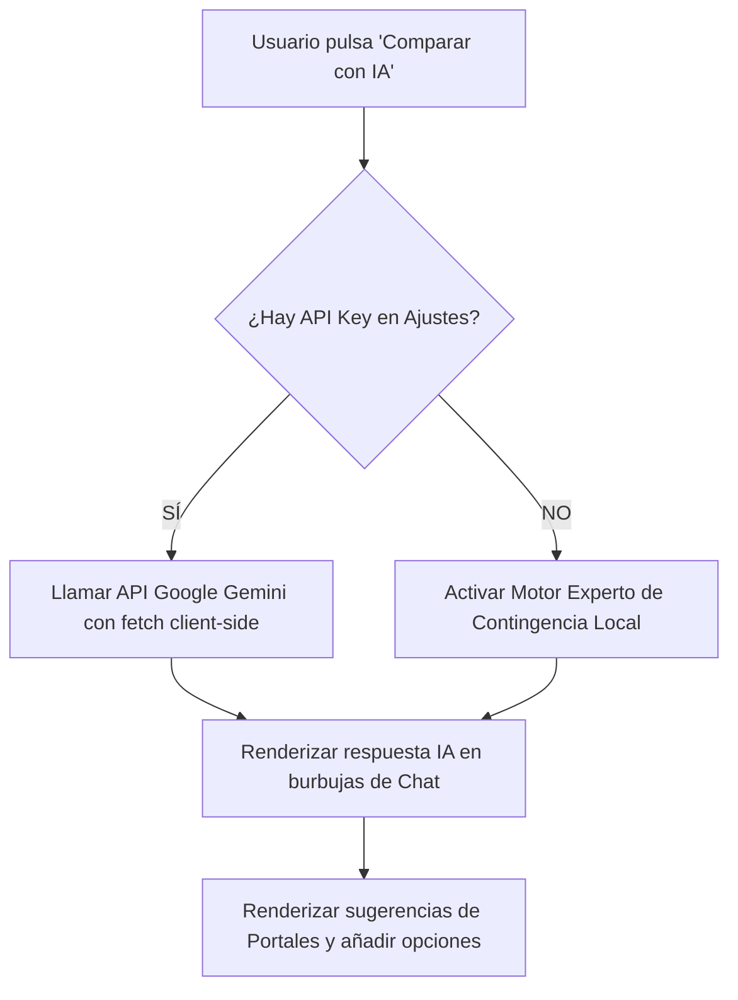

# MANUAL DE ARQUITECTURA TÉCNICA Y ESPECIFICACIONES
## Proyecto: Manza AutoGerma Import (Prototipo Móvil)
**Ubicación de Documentación:** `C:\Users\nacho\OneDrive\Documentos\Import Germany app project\`

---

## 1. RESUMEN EJECUTIVO Y OBJETIVOS

El proyecto **Manza AutoGerma Import** (antes *AutoImport*) es una aplicación móvil web responsiva diseñada para guiar a compradores españoles a lo largo de todo el proceso de importación de vehículos desde Alemania a España. 

### 1.1 Objetivos de la Aplicación
* **Guiar al Usuario**: Ofrecer un flujo interactivo paso a paso que cubra desde la búsqueda inicial hasta el montaje de las placas de matrícula definitivas en España.
* **Calcular Costes Reales**: Proveer un motor de cálculo preciso y dinámico de impuestos españoles (Modelo 576, ITP) y costes logísticos de viaje (vuelos, peajes, combustible y noches de hotel).
* **Comparar Vehículos con IA**: Permitir al usuario comparar hasta 4 modelos de coche simultáneamente empleando un asistente inteligente basado en la API de Google Gemini (con opción de API Key real y motor local analítico de contingencia).
* **Almacenamiento Seguro**: Ofrecer un hub centralizado de control de documentos con un simulador de escaneo de archivos para verificar los trámites obligatorios.

---

## 2. ARQUITECTURA DEL SISTEMA Y STACK TECNOLÓGICO

El prototipo se ha concebido bajo la filosofía de **Single Page Application (SPA) autocontenida de cliente puro**, lo que permite una ejecución instantánea sin servidores locales, bases de datos o compilación previa.

### 2.1 Estructura del Código
```text
autoimport/
├── index.html     # Estructura semántica, plantillas HTML5 y modales
├── style.css      # Sistema de diseño dark mode responsivo y glassmorphism
└── app.js         # Lógica de estados, motores de impuestos, logística e IA
```

### 2.2 Ventajas del Enfoque Client-Side (Cero Dependencias)
1. **Portabilidad Absoluta**: Se ejecuta abriendo el archivo `index.html` directamente en cualquier navegador web moderno (desktop o móvil) a través del protocolo `file:///`.
2. **Eficiencia en Tokens y Rendimiento**: No requiere llamadas de backend intermediarias. Toda la lógica matemática, renderizado de listas e IA de contingencia ocurren localmente en el hilo del navegador.
3. **Resistencia a Fallos**: Si no hay conexión a internet o la API Key de Gemini falla, el motor local analítico asume el control sin romper la experiencia.

---

## 3. SISTEMA DE DISEÑO Y TOKENS VISUALES (CSS)

La interfaz adopta una estética moderna de alta fidelidad tipo **Dark Mode** con acabados de **Glassmorphic** (efectos de cristal translúcido), radiales de luz de fondo y bordes degradados.

### 3.1 Tokens de Color Clave (style.css)
* **Fondo Principal**: `#0a0c10` (Azul profundo de medianoche)
* **Superficies / Tarjetas**: `#151922` (Pizarra oscura) con bordes `rgba(255, 255, 255, 0.08)`
* **Color Primario (Acento)**: `#3b82f6` (Azul Eléctrico)
* **Color Secundario (Acento)**: `#6366f1` (Morado Neón)
* **Éxito (Validaciones)**: `#10b981` (Esmeralda)
* **Advertencias (IVA Nuevo)**: `#f59e0b` (Ámbar)

### 3.2 Marco de Emulación de Dispositivo Móvil
En pantallas de escritorio de gran resolución, el contenedor principal `.app-device-wrapper` limita el viewport a **390px × 844px** (proporción estándar de iPhone 14/15) con bordes biselados gruesos, cámara notch y una sombra exterior masiva. En pantallas de teléfono móvil, las media queries ocultan el hardware de emulación, expandiendo el contenido a pantalla completa al 100% de la pantalla nativa.

---

## 4. MOTOR DE IMPUESTOS Y VALORACIÓN ESPAÑOL (TAX ENGINE)

El núcleo matemático en `app.js` realiza el cálculo dynamic de los impuestos españoles basándose estrictamente en las normativas del **BOE** y las haciendas autonómicas.

### 4.1 Escala de Depreciación BOE (getDepreciationRatio)
Para calcular la base imponible de un coche usado, se aplica un porcentaje corrector sobre el valor de compra original según los meses transcurridos desde su primera matriculación:
$$\text{Base Depreciada} = \text{Precio de Compra} \times \text{Ratio Depreciación BOE} \times \text{Factor de Daño (75\% si aplica)}$$

| Antigüedad en Meses | Porcentaje BOE Aplicado |
|:---|:---|
| $\le$ 12 meses (1 año) | 100% |
| 13 a 24 meses (2 años) | 84% |
| 25 a 36 meses (3 años) | 67% |
| 37 a 48 meses (4 años) | 56% |
| 49 a 60 meses (5 años) | 47% |
| 61 a 72 meses (6 años) | 39% |
| 73 a 84 meses (7 años) | 34% |
| 85 a 96 meses (8 años) | 28% |
| 97 a 108 meses (9 años) | 24% |
| 109 a 120 meses (10 años) | 19% |
| 121 a 132 meses (11 años) | 17% |
| 133 a 144 meses (12 años) | 13% |
| $>$ 144 meses ($>$ 12 años) | 10% (Límite mínimo) |

### 4.2 Impuesto de Matriculación (Modelo 576)
Se calcula aplicando el porcentaje correspondiente del tramo de emisiones de CO₂ sobre la Base Depreciada del BOE:

* **Tramo 1 ($\le$ 120 g/km CO₂)**: **0% (Exento)**
* **Tramo 2 (121 g - 159 g/km CO₂)**: **4.75%**
* **Tramo 3 (160 g - 199 g/km CO₂)**: **9.75%**
* **Tramo 4 ($\ge$ 200 g/km CO₂)**: **14.75%**

#### 4.2.1 Deducciones y Recargos:
* **Familia Numerosa**: Reducción del 50% en el importe final calculado del Modelo 576.
* **Vehículo de Lujo**: Añade un recargo visual arancelario equivalente al 3% del precio de compra.

### 4.3 Impuesto de Transmisiones Patrimoniales (ITP - Modelo 620/621)
El ITP solo se liquida si el coche se compra a un **Vendedor Particular (sin factura de IVA)**. La tasa varía por Comunidad Autónoma de residencia fiscal del comprador. El motor soporta:
* **Asturias, Galicia, Valencia**: **8%** de la base depreciada.
* **Cataluña**: **5%** de la base depreciada.
* **Madrid, Andalucía, País Vasco**: **4%** de la base depreciada.

### 4.4 Alertas de IVA (Vehículo considerado fiscalmente "Nuevo")
Si se detecta que el vehículo tiene **menos de 6 meses** de antigüedad *O* **menos de 6.000 kilómetros**, la aplicación despliega un banner de advertencia crítico: la hacienda española lo considera coche "nuevo", obligando al pago del 21% de IVA en España independientemente de haberlo abonado en origen en Alemania.

### 4.5 Sugerencias Dinámicas de Presupuesto en Calculadora
El módulo de la Calculadora (`page-calculator`) incorpora un panel dinámico y responsivo en la parte superior que lee directamente los coches marcados como seleccionados (hasta 4) en la pestaña de Búsqueda:
* **Cálculo Dinámico In-situ**: El motor de impuestos procesa en tiempo real los atributos individuales de cada coche marcado (precio de compra, emisiones de CO₂, potencia y antigüedad estimada) y calcula instantáneamente su Coste de Importación y su Total Proyecto (Precio del Coche + Coste Importación).
* **Cargar en un Click**: Cada tarjeta de sugerencia cuenta con un botón interactivo de acción ("Cargar"). Al pulsarlo, el sistema transfiere de forma transparente todos los valores técnicos del vehículo a los inputs y deslizadores de la calculadora principal, activando el recálculo total del presupuesto detallado sin requerir entradas manuales del usuario.
* **Indicadores Activos**: Se implementa un estado visual activo (`.active-loaded`) en la sugerencia que coincide con los parámetros actualmente cargados, permitiendo saber en todo momento qué coche se está analizando en la calculadora.

---

## 5. PLANIFICADOR DE LOGÍSTICA DE VIAJE Y ALOJAMIENTO

El módulo de viaje (`page-travel`) compara automáticamente dos opciones logísticas:

### 5.1 Opción A: Transporte por Portacoches Profesional
* **Coste Fijo**: **950,00 €** (Incluye seguro CMR de carga, recogida en concesionario y entrega a domicilio en España en un plazo de 7 a 12 días).

### 5.2 Opción B: Recogida por Carretera (Conducción Directa)
Calcula de forma dinámica la suma de todos los conceptos de viaje para una ruta estándar de 2.100 km:
$$\text{Coste Total Carretera} = \text{Vuelo} + \text{Placas Temporales} + \text{Peajes} + \text{Carburante} + \text{Alojamiento}$$

* **Vuelo de Ida**: **120.00 €** (Estimación de tarifa en Skyscanner).
* **Peajes**: **95.00 €** (Tránsito Francia - España).
* **Placas Rojas Alemanas y Seguro (Ausfuhrkennzeichen)**: **250.00 €**.
* **Consumo de Carburante**:
  $$\text{Carburante} = \left(\frac{2100 \times \text{Consumo L/100km}}{100}\right) \times \text{Precio Carburante por Litro}$$
* **Alojamiento (Integración Booking/Trivago)**:
  $$\text{Alojamiento} = \text{Noches de Hotel} \times 85.00 \text{ €}$$
  *El número de noches (slider de 1 a 5) se multiplica por una tarifa media de 85€/noche y se integra de forma directa tanto en el desglose de viaje como en el presupuesto general del Dashboard.*

---

## 6. ASISTENTE COMPARADOR CON INTELIGENCIA ARTIFICIAL (GEMINI AI)

La característica central del primer módulo permite elegir hasta 4 vehículos y lanzar una ventana modal de análisis avanzado impulsada por Inteligencia Artificial.

### 6.1 Esquema Híbrido Token-Efficient (Cliente Puro)



### 6.2 Lógica de la API Real
Se conecta directamente mediante peticiones `POST` al endpoint oficial de Google Gemini 1.5 Flash:
* **Endpoint**: `https://generativelanguage.googleapis.com/v1beta/models/gemini-1.5-flash:generateContent?key=[API_KEY]`
* **Body**:
  ```json
  {
    "contents": [{ "parts": [{ "text": "Mensaje del usuario y metadatos de coches" }] }],
    "generationConfig": { "maxOutputTokens": 800, "temperature": 0.7 }
  }
  ```

### 6.3 Motor de IA Analítico de Contingencia Local
Si no hay API Key guardada en el `localStorage`, el sistema simula un análisis mecánico de alta fidelidad:
* **Preguntas sobre Impuestos**: Computa las diferencias exactas de CO₂ entre los modelos y determina cuál pagará menor Modelo 576.
* **Preguntas de Negociación**: Genera una lista de 5 preguntas técnicas críticas en Alemania (MwSt deducible, COC original, HU/AU de TÜV, historial Scheckheftgepflegt).
* **Preguntas de Consumo y Ruta**: Calcula el coste real de combustible para los vehículos elegidos basándose en sus consumos mixtos reales.
* **Pros y Contras**: Detalla de forma individual los puntos fuertes y débiles de fiabilidad típicos (Audi S-Tronic, cadenas BMW, cajas Mercedes, consumos económicos de VW Golf).

### 6.4 Adición Dinámica de Portales Sugeridos
La IA sugiere portales alternativos de venta o concesionarios oficiales en Alemania (e.g., *AutoGott.de*, *Auto-Park Rath*). Cada portal sugerido renderiza una tarjeta con un botón activo **"+ Añadir opción al panel"**. Al hacer clic, la aplicación añade automáticamente ese vehículo simulado con especificaciones refinadas de menor precio/km al panel de coches de la aplicación principal.

---

## 7. CÓMO EXPORTAR ESTE MANUAL A MICROSOFT WORD

Para convertir este documento de arquitectura técnica en un archivo oficial de Microsoft Word (`.docx`) manteniendo todos los estilos, tablas y estructuras:

1. **Abrir Microsoft Word**.
2. Ir a **Archivo > Abrir** y buscar este archivo:
   `C:\Users\nacho\OneDrive\Documentos\Import Germany app project\Architecture_Handbook.md`
3. Microsoft Word interpretará las cabeceras (`#`, `##`), listas y negritas del formato Markdown convirtiéndolas automáticamente a estilos de Word.
4. Una vez abierto, ve a **Guardar como...** y selecciona la extensión **Documento de Word (*.docx)**.
5. *(Opcional)* Aplica tu plantilla corporativa favorita de Word para pulir las portadas y márgenes del manual.
